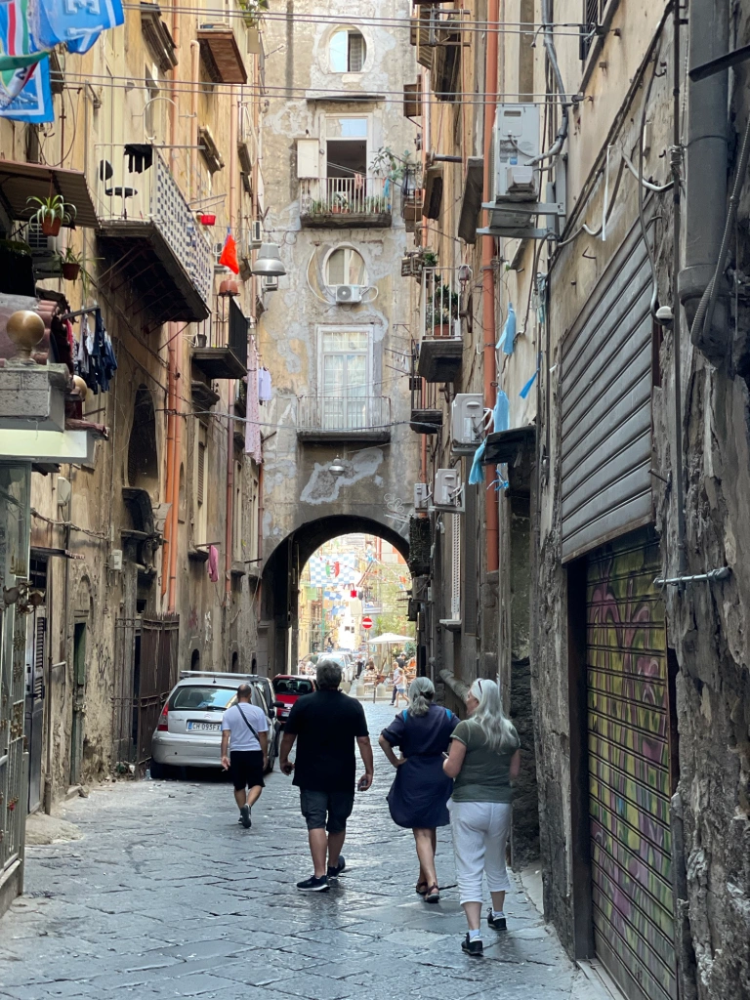

# Naples. Fin de la saison 6 d’Omer

Le guide du Routard a une particularité que nous apprécions beaucoup. Sa rubrique logements est toujours truffée d'adresses atypiques et originales bien loin du standard impersonnel des chaînes d’hôtels internationaux ou de celui des chambres AirBnB très Ikéaisées.

Ainsi en est-il du logement que nous avons repéré à Naples situé dans un ancien presbytère.

D’aspect extérieur l'entrée de l’immeuble où nous dépose le taxi est assez délabré mais car il y a toujours un mais la surprise est à l'intérieur.

Un grand escalier en vieilles pierres mène à un immense appartement très haut de plafond dont les fenêtres donnent sur le patio de l’ancien presbytère. Aux murs sont accrochés des dizaines de tableaux représentant toutes sortes de poissons, des portraits de famille, des œuvres contemporaines. Un bric à brac d’objets anciens et originaux posés sur des meubles rustiques confèrent à l’ensemble un petit côté cabinet de curiosités où l’on circule avec étonnement. Ici un animal exotique empaillé, là une horloge qui fait aussi miroir etc.

<!-- more -->

Le propriétaire, un homme d’une cinquantaine d’années, nous reçoit dans un anglais parfait. Il nous raconte qu’il est le descendant d’une famille d’artistes napolitains dont toutes les œuvres accrochées aux murs sont en grande partie celles de son arrière grand-père et de son grand-père. Lui-même est marchand d’art et artiste à ses heures perdues mais sa véritable passion est de conserver ce lieu unique en bon état, un travail quasi à plein temps.

Munis d’un plan offert par notre propriétaire qui a eu la gentillesse de nous indiquer les curiosités à ne pas manquer, nous voici déambulant dans les rues de Naples à la recherche de la plus vieille pizzeria de la ville.

Nous sommes surpris par la vétusté et la crasse qui règnent un peu partout. Les façades aux couleurs passées sont décrépites et surchargées de climatiseurs et d’antennes de télévision accrochés n’importe où et n’importe comment. Les balcons sont remplis de linge qui sèche, de vélos, d’armoires et des centaines de fils électriques reliant les immeubles entre eux dessinent de façon anarchique une sorte de gigantesque toile d’araignée métallique.

Le propriétaire nous avait prévenu :

> Vous allez voir la ville est dégueulasse. Tout l’argent public destiné à l’entretien de la ville va dans les poches de la Mafia qui n’en redistribue qu’une petite partie. Quant aux ports, c’est la même chose, ils sont tous entre les mains des mafieux qui pratiquent des prix exorbitants. Tous les petits propriétaires ont du vendre leur bateau, pour les Napolitains c’est une catastrophe.

Pourtant cette ville en haillons dégage un charme extraordinaire. Partout la vie grouille. Dans les rues, les cours d’immeubles, les cages d’escaliers, sur les trottoirs, les places, les balcons. Mais le plus étonnant est le culte que vouent les Napolitains à Diego Maradona.

Des milliers de photos, posters, affiches, dessins, tags pullulent sur les murs, les vitrines des magasins, les entrées d’immeubles, les volets métalliques ou encore à côté des statues de la Vierge Marie enfermées dans des ex voto un peu partout dans la ville.

Suspendues au dessus des rues, des milliers de banderoles bleues et blanches aux couleurs du SSC de Naples relient les façades entre elles.

Naples est une ville où l’on ne sait plus où donner de la tête, en haut, en bas, à droite, à gauche, où que l’on regarde, pas un mètre carré n’échappe à la frénésie du foot et de son Dieu.

En proie à une folie collective, le peuple napolitain continue à célébrer son idole, trente ans après que celui-ci lui eut offert sa première victoire de champion d’Italie. Les souvenirs ont la peau dure, à Naples peut-être plus qu’ailleurs.

Après notre séjour à Naples durant lequel nous avons visité l’admirable site archéologique d’Herculanum, nous voici à nouveau seuls, Laurence et moi à bord d’Omer.

Comme prévu nous remontons le bateau jusqu’à Ostia et nous engageons dans le Tibre à la recherche du chantier naval où nous avons prévu d’hiverner Omer.

Le courant contre nous est puissant et nous oblige à mettre les gaz; tiens tiens, on se croirait presque en Bretagne…

La marina se trouve en face d’une île sauvage. L’endroit est assez inattendu mais le chantier a l’air très bien tenu et l’hôtesse qui nous accueille, Oliva, est efficace et très aimable

En attendant qu’Omer soit mis au sec, nous faisons la connaissance d’un couple de Romains fort sympathique. Ils naviguent, chose rare en Italie, sur un bateau de la même taille qu’Omer, un Pogo 30 avec lequel ils ont déjà sillonné toute la Méditerranée. Ils connaissent toute la côte italienne par coeur et nous donnent des renseignements très utiles pour notre future croisière l’année prochaine.

Mais ceci est une autre histoire.

Pour l’instant nous avons une table retenue dans le restaurant de la marina qui affiche fièrement une étoile au guide Michelin ! C’est donc sur une note culinaire que s’achève la saison 6 d’Omer, l’Ombrina al salmoriglio e misticanza aromatica di campo ça n’attend pas !

